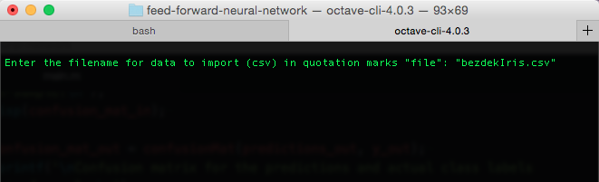
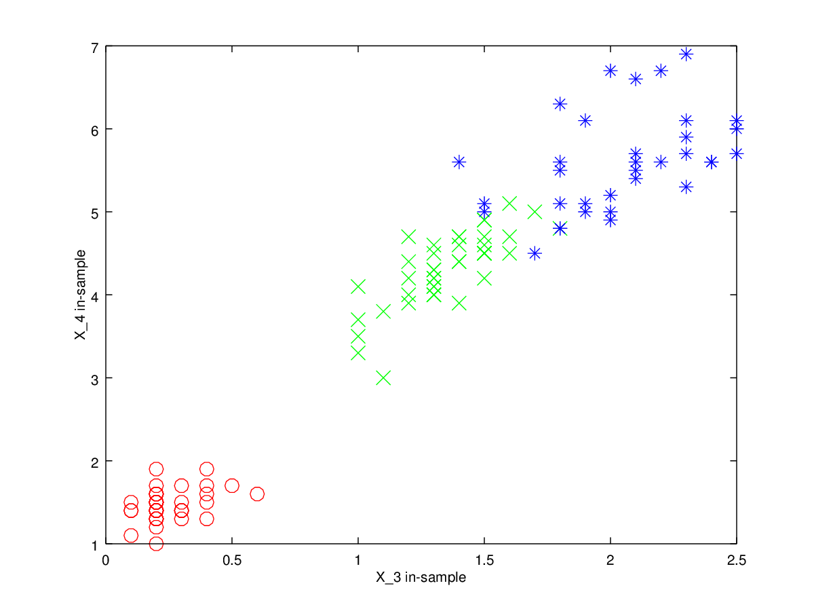
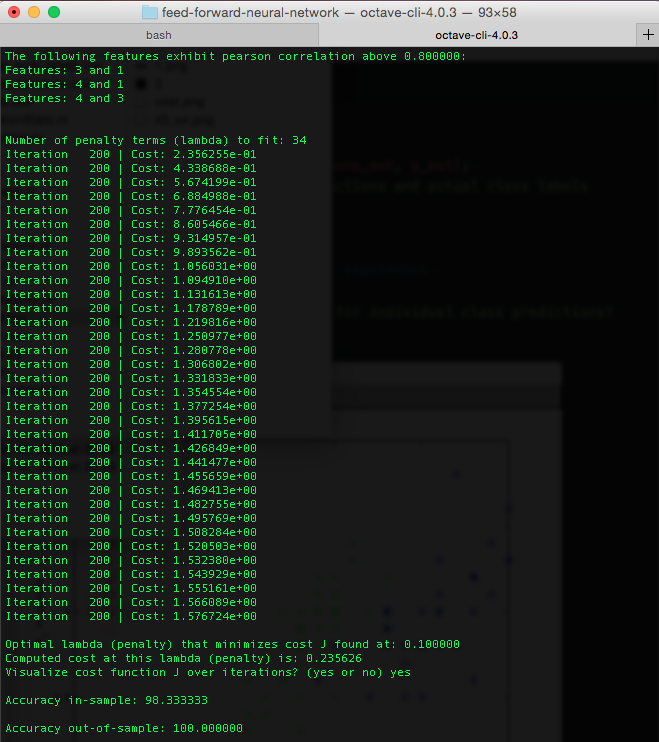
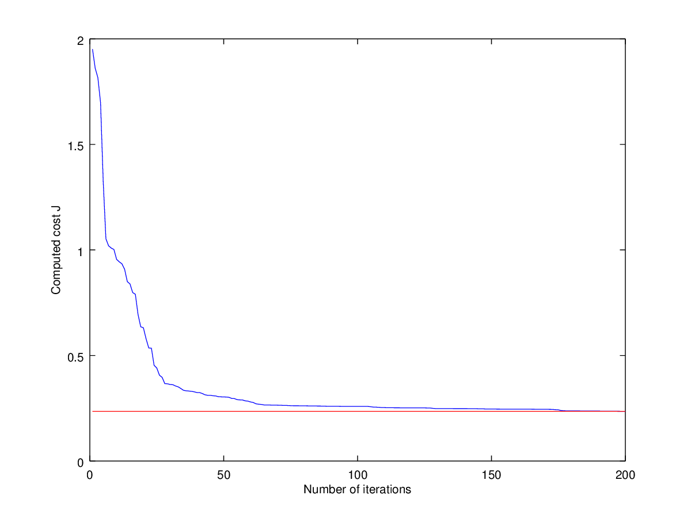
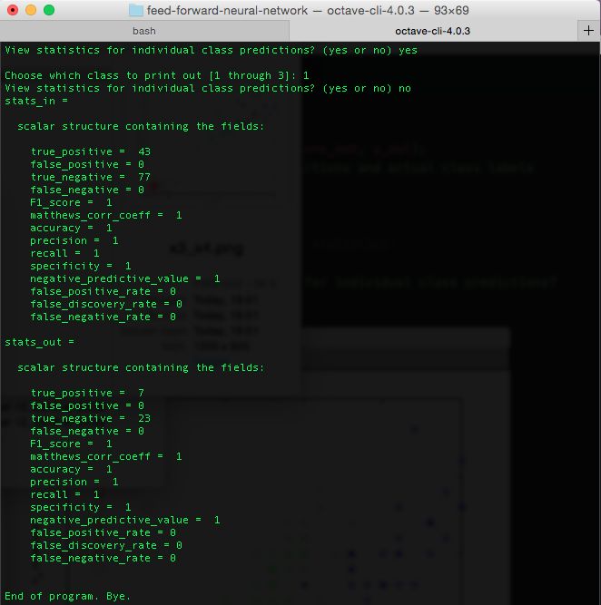

# A Feed-Forward Neural Network
This is a generic, three-layered feed-forward neural network (FFNN) written in **matlab/octave**. It makes heavy use of vectorized computation models for efficiency, and is useful for a number of different types of machine learning classification problems.

## Content Description
There are four functions that make up the actual code that represents and computes the parameters for the neural network: `cost.m`, `randomWeights.m` and `predictor.m`.

`cost.m` represents the general vectorized cost function for the neural network. This is the computationally most intensive part of designing and finding the optimal parameters for the neural network.

`optimalParams.m` estimates and returns the optimal set of parameters for the neural network, and the choice of regularization penalty that had the most impact on minimizing the cost function.

`randomWeights.m` creates and initializes randomized values for the neural network parameters in order to break the symmetry of the model.

`predictor.m` estimates predictions based on the parameters found by minimizing the cost function and extracting the optimal parameters.

There are also a number of _utility_ functions to help make parameter and model analysis easier:

`plotData.m` visualizes all possible permutations of features, from N choose 2, to help identify any patterns or possible linear dependence and multicollinearity. For classification problems with more labels than there are markers available to plot the labels uniquely according to the features, a warning will be displayed.

`sigmoid.m` computes the sigmoid for a given scalar, vector or matrix.

`sigmoidGradient.m` computes the numerical gradient of the sigmoid function based on the analytical result of taking the gradient of the sigmoid function with respect to the parameters.

`importImage.m` is a convenience image importer for computer vision problems. Currently it imports a given image based on the absolute or relative _file path_, and converts the image to a matrix with `W x H x D` dimensions, where `W`, `H` and `D` are width, height and color-depth, respectively. An RGB image would therefore have `D = 3`.

`confusionMat.m` computes the confusion, or contingency table, for the predicted and actual labels in a given multi-class classification problem. It supports an arbitrary number of class labels.

`classificationStats.m` computes a number of statistics for a given confusion matrix and returns the results in a `struct`. Currently, the following metrics are computed:

- F1 Score
- Matthews Correlation Coefficient
- Accuracy
- Precision
- Recall
- Specificity
- Negative Predictive Value
- False Positive Rate
- False Discovery Rate
- False Negative Rate

`splitDataSet.m` takes a data set and ratios that determine the size of the training set and cross validation sets, respectively. The remainder will be the out-of-sample test set.

`fmincg.m` is an efficient minimization solver, courtesy of Carl Edward Rasmussen.

`setLabels.py` is a utility script written in Python that computes unique numerical labels for from data sets where the class labels are strings. Mostly because matlab doesn't operate efficiently on strings. The function writes out `.csv` files with the new labels, as well as a file that indicates the number of unique labels found in the data set.

## Example Usage Through `main.m`
The `main.m` file showcases an example of how to use the neural network in practice. I've used one of the most popular data sets for aspiring machine learners to show how a feed-forward neural network can be designed and parametrized using forward and backward propagation. The data set is the classical _Iris Data Set_, courtesy of R.A. Fisher and Michael Marshall.

### Steps

1. `main.m` makes use of the `setLabels.py` script to import data for users who aren't comfortable with using Python directly. The data is also randomized by rows in order to allow for in- and out-of-sample testing of the final neural network classifier.

2. The data is then optionally visualized, by plotting the features against the different classes, as well as between the features themselves.

3. Covariance and pearson correlation matrices are estimated and benchmarked against a correlation threshold of `0.8`. Any features with correlation higher than this threshold will be printed out.

4. Input and hidden layer sizes, e.g. the number of neurons, are set. The first activation layer consists of the features themselves. The hidden layer size is set to twice the number of input features. The optimal parameters are found using `optimalParams.m`, and there is an optional visualization of the cost as a function of the number of iterations by the optimal penalty score the algorithm identified.

5. Predictions are made using the `predictor.m` function, both for in- and out-of-sample sub-sets of the data.

6. Analysis of errors, in- and out-of-sample is made together with a showcase of the classification statistics mentioned previously.

## Example Outputs

### Selecting Data Set

### Visualizing Features and Labels

### Estimating the Parameters for the FFNN

### Visualizing the Cost function

### Viewing the Classification Statistics

## License
Author: Hugo Nordell

MIT. 2016.
